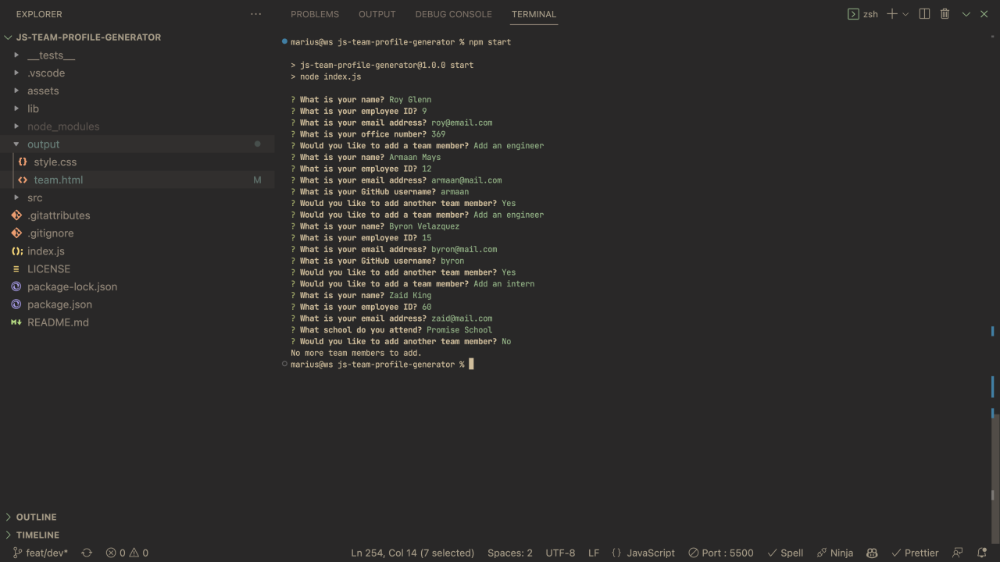
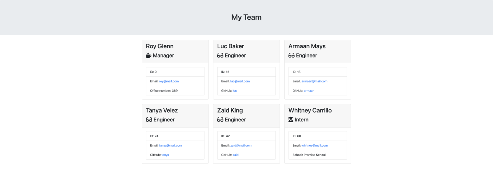

# Team Profile Generator

[](LICENSE)


## Shot Project Description

This is a command-line application that dynamically generates a team.html page based on the user's input using the Inquirer package.

Application demo example


Generated **team.html**


---

## Table of Contents

- [Installation](#installation)
- [Usage](#usage)
- [Tests](#tests)
- [Contributing](#contributing)
- [License](#license)

## Installation

First, clone the repository to your local machine. Then, navigate to the root directory of the project and run the following command:

```bash
npm i
```

## Usage

To use the application, you must first run the following command:

```bash
npm start
```

Then, answer the prompts as they appear. Once you have completed the prompts, a team.html file will be generated in the output directory, that contains the information you provided in the prompts.

## Tests

To run the tests, you need to run the following command:

```bash
npm run test
```

## Contributing

Contributions, issues and feature requests are welcome. Browse the source repository and open a pull request. I will do my best to review your proposal in due time.

## License

This project is licensed under the terms of the [MIT license](LICENSE).
